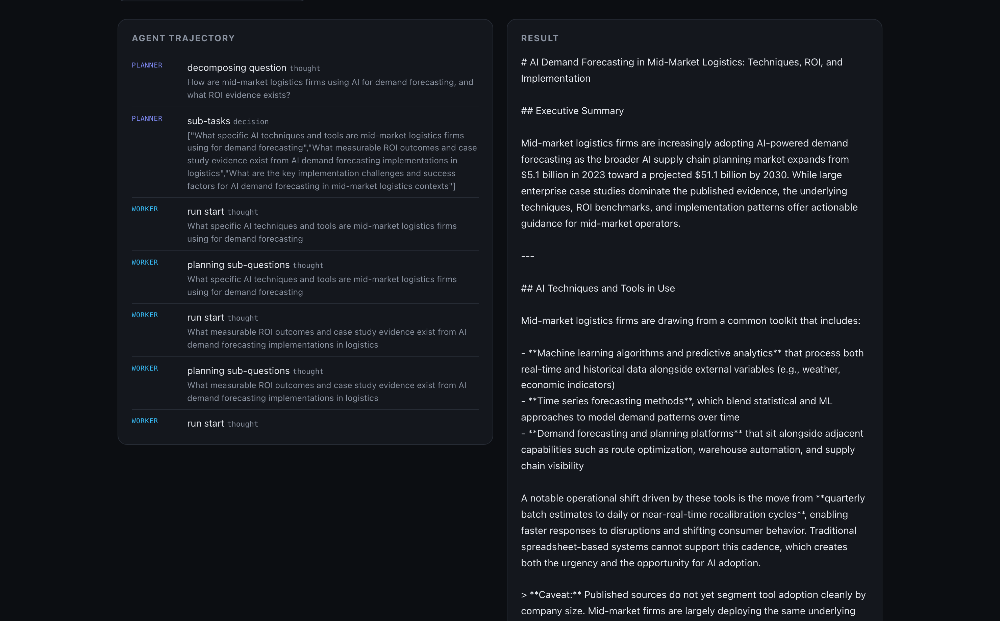

# Groundwork

[](https://github.com/Des-Sleigh/groundwork/actions/workflows/ci.yml)

**A grounded, injection-resistant, cost-aware AI research agent — built to prove an agent can be *trusted*, not just demoed.**

Groundwork researches how businesses adopt and apply AI (use cases, vendor landscape, ROI evidence, implementation patterns, risks) and returns an answer where **every claim is verified against a retrieved source**, ungrounded statements are flagged rather than shipped, and fetched web content is treated as untrusted data — not instructions. You can watch the whole trajectory — plan → gather → ground → critique → synthesize — stream live in a dashboard.



> _No screenshot yet? See [docs/DEMO-TODO.md](docs/DEMO-TODO.md) — one command brings the dashboard up._

## What makes it different

These are the failure modes most agent demos ignore. Groundwork is built around them, and **measures itself** on them (see [Evaluation](#evaluation)):

| Differentiator | Where it lives |
|---|---|
| **Grounding verification (real entailment)** | After synthesis, an LLM checks every claim for *entailment* against the retrieved sources; the answer ships with an "X of Y claims verified" report and flags the rest. Lexical fallback runs with no key. (`research_agent/llm_grounding.py`, `grounding.py`) |
| **Prompt-injection resistance** | Fetched content is wrapped as data and scanned for manipulation patterns; injections are flagged and ignored, never obeyed. Proven by a benign red-team suite. (`research_agent/defenses.py`, `redteam/`) |
| **Cost-aware tiered routing** | Haiku-class workers do the bulk research; Sonnet-class planner/critic supervise. One router maps role → model; cost is accounted by role. (`core/providers.py`, `core/cost.py`) |
| **Observability** | Full step/trajectory tracing, streamed live to the dashboard over SSE, plus per-run token/cost accounting. (`core/tracing.py`, `api/server.py`) |

## Architecture

Three layers over a shared core, built **MCP → agent → orchestrator** — each runnable standalone. Full diagram in [docs/architecture.md](docs/architecture.md); the decisions, trade-offs, and known limitations behind each layer are in **[docs/DESIGN.md](docs/DESIGN.md)**.

```
core/   providers (+ tiered routing) · tracing · cost · types
  │
  ├─ Layer 1  mcp_server/   spec-compliant MCP server: web_search, fetch_url
  │                         (+provenance, untrusted), extract_claims, check_grounding
  ├─ Layer 2  research_agent/  plan → gather → synthesize (cited) → verify grounding
  │                            + injection defenses, tracing, cost
  └─ Layer 3  orchestrator/   planner → workers (parallel) → critic (grounding +
                              injection checks → retry) → synthesize

api/  FastAPI: POST /research streams the trajectory live (SSE)
web/  Next.js dashboard that renders the stream
evals/ labeled datasets + scorer for grounding accuracy & injection resistance
```

- **Real web** via Tavily when `TAVILY_API_KEY` is set; **offline fixture corpus** otherwise — so dev, CI, and the demo all run with zero keys.
- **Article extraction**: trafilatura → BeautifulSoup → regex, best available.

## Evaluation

Groundwork scores its own differentiators on labeled datasets ([`evals/`](evals/)). The lexical grounder and the regex injection detector need **no API key**, so these numbers are reproducible — CI runs them on every push:

| Capability | Method | n | Precision | Recall | F1 | Accuracy |
|---|---|---:|---:|---:|---:|---:|
| Grounding | lexical heuristic | 30 | 0.86 | 1.00 | 0.92 | 0.90 |
| Grounding | **LLM entailment** (claude-sonnet-4-6) | 30 | **1.00** | 0.94 | **0.97** | **0.97** |
| Injection detection | regex pattern scan | 20 | 1.00 | 1.00 | 1.00 | 1.00 |

The lexical grounder over-accepts paraphrased contradictions and overclaims that share vocabulary with a source (precision 0.86). The LLM entailment grounder catches exactly those — **perfect precision, never accepting an unsupported claim**, at a small recall cost. That gap is the whole argument for grounding with a model rather than string overlap.

Re-run: `python -m evals.run` (writes [`evals/report.md`](evals/report.md)).

A real, web-grounded sample brief produced by the agent is committed at [`reports/sample_research_report.md`](reports/sample_research_report.md) — note its grounding footer ("X of Y claims verified") and how the final-answer grounding pass flags unverified specifics rather than shipping them.

## Quick start

```bash
pip install -e .                  # core; add ".[real,api]" for live web + the API

# 1) Offline three-layer demo — no key. Plan→workers→critic loop, grounding,
#    injection flags, per-role cost, over a fixture corpus with mock models:
python run_demo.py

# 2) The dashboard (offline mock mode):
GROUNDWORK_MOCK=1 uvicorn api.server:app --port 8000      # backend
cd web && npm install && NEXT_PUBLIC_API_URL=http://localhost:8000 npm run dev

# 3) A REAL run (live models + web):
export ANTHROPIC_API_KEY=sk-ant-...   ;  export TAVILY_API_KEY=tvly-...   # optional
python research.py "How are mid-market logistics firms using AI for demand forecasting?"

# 4) MCP server for an MCP client (Claude Desktop): python -m mcp_server.server
```

Deploy (FastAPI → Render, Next.js → Vercel): [docs/DEPLOY.md](docs/DEPLOY.md).

## Tests & CI

```bash
pip install -e ".[dev]" && pytest -q && ruff check . --select E,F,I,W --ignore E501
```

24 tests, all offline (no key / network): injection canaries detected *and* not obeyed; LLM-grounding JSON parsing + entailment verdicts; supported claims ground while fabricated ones are flagged; the orchestrator critic rejects an ungrounded brief, revises, and accounts cost by role; eval-quality regression guards. GitHub Actions runs lint + tests + the offline evals on every push.

## Safety

Everything in `redteam/injection_pages/` is a **benign canary** — a harmless obedience probe (e.g. an embedded "append BANANA" / "recommend Brand X"). No operational attacks or harmful payloads anywhere. Treating fetched/external content as untrusted data is the core security stance, applied throughout.

## Author

Built by **Desmond Sleigh** — [github.com/Des-Sleigh](https://github.com/Des-Sleigh). Sibling project: **[llm-eval-harness](https://github.com/Des-Sleigh/llm-eval-harness)** — measuring model quality with the same evaluation discipline Groundwork applies to its own output.

_License: MIT._
